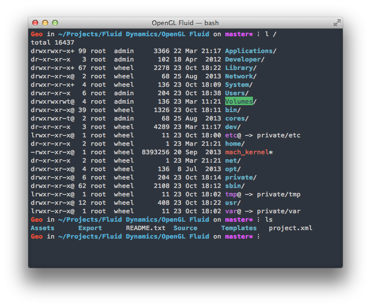

Better Terminal
========

My .bash_profile and terminal settings for OS X, however most things should work under linux.
Colors based on [ahmetsulek's Flat Terminal](https://github.com/ahmetsulek/flat-terminal)

Also includes iTerm2 colours scheme



###Installation
- Put the .bash_profile into your home directory (`cd ~`)
- Open the .terminal file and change terminal profile preferences to set it as the default
- Don't forget to customise the user specific aliases and settings at the top of *.bash_profile*


###### Alternatively use a sym link
Navigate to where you've chosen to placed the files or cloned the repo and run:

```bash
ln -s $(pwd)/.bash_profile $HOME/.bash_profile
ln -s $(pwd)/.inputrc $HOME/.inputrc
open ./Haxiomic.terminal
```

###Aliases & Features
######files
- **s** - *opens a file in sublime text*
- **o** - *short for open. 'o' opens the current directory in finder* 
- **highlight** *\<file\>* - *syntax highlighting in terminal*
- **trash** *\<file\>* - *move file to trash*
- **l** - *list files in long format*
- **la** - *list all files including dotfiles, in long format*

######navigation
- **z** *<search string>* - *jump to commonly used directories*
- **bk** - *go back a directory*
- **desktop** - *cd ~/Desktop*
- **..** 	- *cd ..*
- **...** 	- *cd ../..*
- **....** 	- *cd ../../..*
- **.....** - *cd ../../../..*

######git
- **gs** - *git status*
- **ga** - *git add .*
- **gc** *\<message\>* - *git commit -m*
- **gca** *\<message\>* - *git commit -a -m*
- **gcap** *\<message\>* - *git commit -a -m \<message\> && git push*
- **push** - *git push*
- **pull** - *git pull*
- **gsetup** *<repo-url>* - *initialises repo with a given url*
- **gbrowser** - *opens the current remote origin url in the browser*

######other
- **[TAB] Autocomplete is improved with single tab instead of two and case insensitivity**

- **show** / **hide** - *show/hide hidden files* 
- **sman** - *open man page with text edtior*
- **speedread** *\<file\>* - *Spritz like speed reader in terminal*
- **deleteExtraBashScripts** - *clears auto-installed bash-scripts*

###Auto-installed scripts

Additional scripts installed into ~/.bash_scripts/ on first run

- [git-completion](https://github.com/git/git/tree/master/contrib/completion) - Autocomplete for git from Github's main repository
- [z jump script](https://github.com/rupa/z) - 'Tracks your most used directories, based on frequency'
- [trash](https://github.com/morgant/tools-osx) - 'trash allows trashing of files instead of tempting fate with rm'
- [speedread](https://github.com/pasky/speedread) - 'A simple terminal-based open source Spritz-alike'

###Dependencies

- [pygmentize](http://pygments.org/) for syntax highlighting in terminal (use bash alias **c** *\<file\>*) can be installed with `sudo easy_install Pygments`
